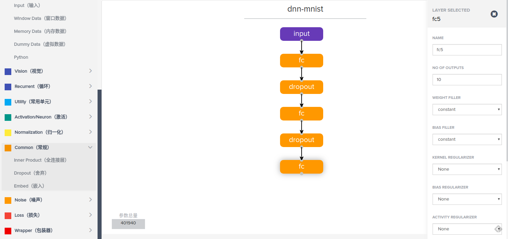

# mnist例子

这篇文档里为大家提供一个通过VisualNN来构建一个简单的DNN来进行手写字符识别。具体的步骤可以表示为
1. VisualNN中构建网络结构
2. 导出模型到本地或者HDFS
3. 运行训练脚本得到训练好的权重文件
4. 运行预测脚本进行字符识别
下面我们分节介绍每个步骤

# 1. 构建网络结构

这里我们构建一个最简单的三层DNN的分类网路，首先第一步是构建输入层， 这里的主要目的是指定输入的数据的维度.

首先从左侧点击数据section中的Input块, 这会在右侧的panel中添加输入层，然后点击panel中新生成的输入层，右侧会显示出这一层的参数，我们设置右侧的参数为(1, 784)， 输入层就构建完成了。


接下来是构建三层的DNN， 我们点击左侧Common中的全连接层，右侧会自动添加一个全连接层并从之前构建的网络中连接一条线到新创建的神经网络层， 如果没有自动连接可以手动连接一下， 之后我在右侧设置全连接层的参数， 可以看到全连接层有很多复杂的参数， 如果不理解请参见tensorflow的文档， 在这里我们设置输出维数为512, 具体过程如下图所示


然后再添加Common中的DropOut层, 我们设置drop的几率为0.2, 如下所示


然后按照同样的方法在添加两个叠加的DNN和DropOut层， 注意最后一个DNN要将输出维数设置为10， 因为我们要进行手写字符识别（0~9），总共10个数字， 具体如下图所示。



最后再添加一个Utility中的softmax层， 不需要设置参数，softmax层将会输出每个类别的概率， 如下图所示。


至此我们已经构建完成了一个简单的DNN网络， 下一步就是导出模型

# 2. 导出模型

点击左侧export功能下的keras可以将模型导出到本地磁盘，或者导出到HDFS上（未完成）TODO， 在导出的同时会在数据库中插入一个算子, 具体导出过程如下图所示


在这次演示中我们将刚刚搭建好的模型导出到本地磁盘上， 比如导出到VisualNN项目目录model下的dnn_mnist.json。

# 3. 运行训练脚本

训练脚本保存在script目录下的train.py文件， 输入参数格式为TODO， 我们可以按照下面的方式调用这个训练脚本

```
python train.py ../models/temp.json ~/.keras/datasets/preprocessing_minist.npz temp.h5
```


上面参数从左到右分别是模型结构文件, 训练数据集路径, 权重输出路径.

训练过程会输出迭代过程中的精度, 如下图所示。


训练得到的权重文件将保到指定的目录下

# 4. 模型测试

测试脚本保存在script下的eval.py, 具体调用方法如下所示

```
python eval.py ../models/vgg16.json ../models/vgg16_weights_tf_dim_ordering_tf_kernels.h5 ../models/data/test/Coffee-Mug.jpg
```

目前预测结果采用的方式是输出到标准输出，可以通过重定向的方法输出到文件中从而进行后续操作


